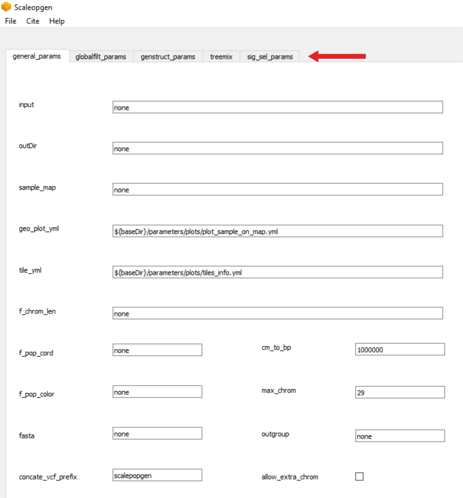
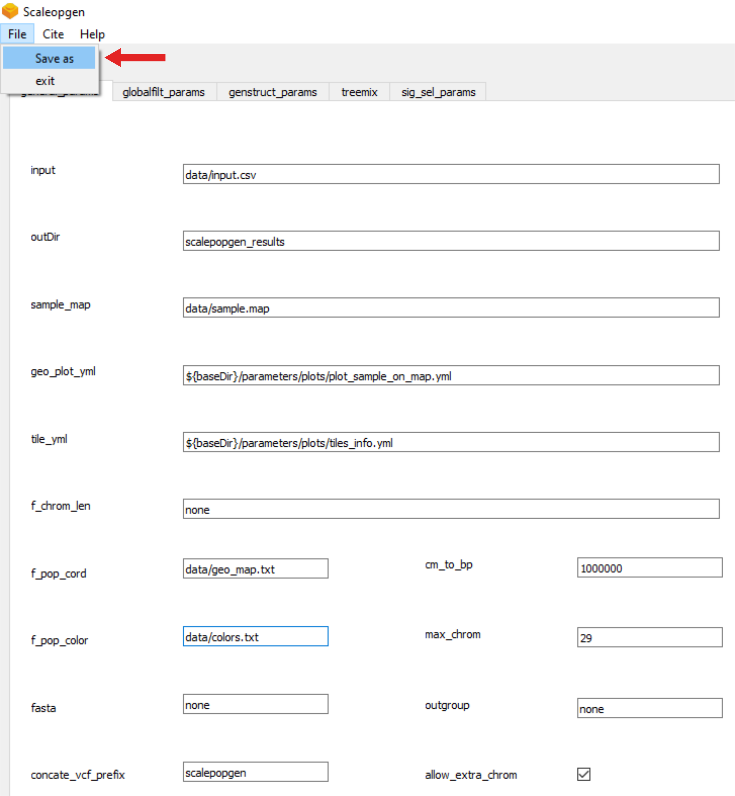

---


---

<h1 id="scalepopgen">scalepopgen</h1>
<p>Pipeline to carry out comprehensive population genomic analyses.</p>
<h2 id="table-of-contents">Table of contents</h2>
<ul>
<li><a href="#about-scalepopgen">About scalepopgen</a></li>
<li><a href="#setup-and-test-the-pipeline">Setup and test the pipeline</a></li>
<li><a href="#creating a yaml file of the parameters">Creating a yaml file of the parameters</a></li>
<li><a href="#to-do">To do</a></li>
</ul>
<h3 id="about-scalepopgen">About scalepopgen</h3>
<p>scalepopgen is a fully automated nextflow-based pipeline that takes vcf files or plink generated bed files as input and employ a variety of open-source tools to carry out comprehensive population genomic analyses. Additionally, python and R scripts have been developed to combine and (wherever possible) plot the results of various analyses.</p>
<p>Broadly, the pipeline consists of the following four “sub-workflows”:</p>
<ul>
<li><a href="./read_me/filtering_snps_and_indi/run_filter.md">filtering and basic statistics</a></li>
<li><a href="./read_me/explore_genetic_structure/run_pca_admixture.md">explore genetic structure</a></li>
<li><a href="./read_me/treemix/run_treemix.md">phylogeny using treemix</a></li>
<li><a href="./read_me/run_signatures_of_selection/run_signatures_of_selection.md">signature of selection analysis</a></li>
</ul>
<p>These four sub-workflows can be run separately or in combination with each other.</p>
<h3 id="setup-and-test-the-pipeline">Setup and test the pipeline</h3>
<p>The pipeline can be run on any Linux operating system and require these three dependencies: Java, nextflow (<a href="https://www.nature.com/articles/nbt.3820">Di Tommaso et al., 2017</a>) and a software container or environment system such as <a href="https://docs.conda.io/projects/conda/en/latest/user-guide/install/linux.html">conda</a>, <a href="https://mamba.readthedocs.io/en/latest/installation.html">mamba</a>, <a href="https://sylabs.io">singularity</a>, or <a href="https://www.docker.com">docker</a>. The pipeline can also be run on both local linux system as well as high performance computing (HPC) clusters. Note that all the software related dependencies of the pipeline will be handled by nextflow after it is installed. Meaning that the user install only the three dependencies listed above, while nextflow automatically downloads the rest of the tools for the analyses. scalepopgen was built and tested on nextflow version 22.10.6.5843, conda version 23.1.0 and singularity version 3.8.6.</p>
<p>To test the pipeline, simply run the following command:</p>
<pre class=" language-bash"><code class="prism  language-bash">nextflow run scalepopgen.nf -profile mamba,test_genstruct
</code></pre>
<p>The output folder will be created here:"…/test_genstruct_out/". The folder will contain interactive plots for PCA, Fst-based NJ tree, IBS-based NJ tree. It will also contains plots for “ADMIXTURE” analyses. These plots can be customized using the yaml file present inside the ". /parameters/plots/ "folder. Description of the inputs and outputs of the test run can be found here.</p>
<h3 id="creating a yaml file of the parameters">Creating a yaml file of the parameters</h3>
The workflow implement a lot of programs and tools, with the aim of enabling users to perform a wide range of analyses. This also brings with it a large number of parameters that need to be determined for each sub-workflow. In order to make it more easier for user, we developed graphical user interface (GUI). This GUI is available as an executable within the "scp_config_generator" folder within this repo. With GUI you can specify analyses and their options by moving through the tabs of each workflow section marked with the arrow.



Once you select and specify the parameters according to analyses you want to perform, simply click on "File" and "Save as" yml file.



After that run it with the command:
```
nextflow run scalepopgen.nf -params-file analyses.yml -profile <conda,mamba,singularity,docker> -qs <number of processes>
```
A great advantage of this workflow are the interactive plots generated using [bokeh](http://bokeh.org/), which are stored in the output folder of the respective analysis. They provide the user with a graphical interpretation of the results, allowing to immediately get an impression about the genomic patterns of the analyzed samples. As an example, please take a look at [the interactive plots](https://bioinf2305.github.io/scalepopgen_results/) created with cattle data in all the different analyzes offered by the workflow.
<h3 id="extra-notes">Extra notes</h3>
<p>Note that read me associated with the workflow will be extensively updated in the coming days. Before using the tiles for your publication do not forget to include the attribution. This package comes with the tile from Esri, therefore, these rules must be followed: <a href="https://developers.arcgis.com/documentation/mapping-apis-and-services/deployment/basemap-attribution/">https://developers.arcgis.com/documentation/mapping-apis-and-services/deployment/basemap-attribution/</a>. The paper to cites have been mentioned in the respective read me documentation.</p>
<h3 id="to-do">To do</h3>
<p>1). complete the read me for all the sub-workflows.<br>
2). test the signature of selection extensively.<br>
3). add validation for all the features of the workflow.<br>
4). a gui to make parameter files</p>

