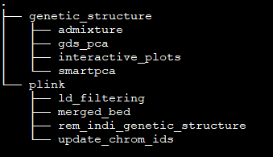
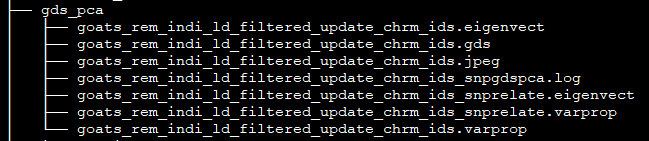
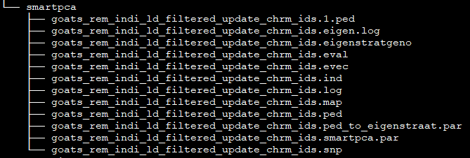
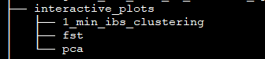
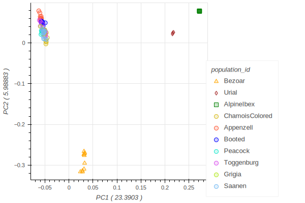
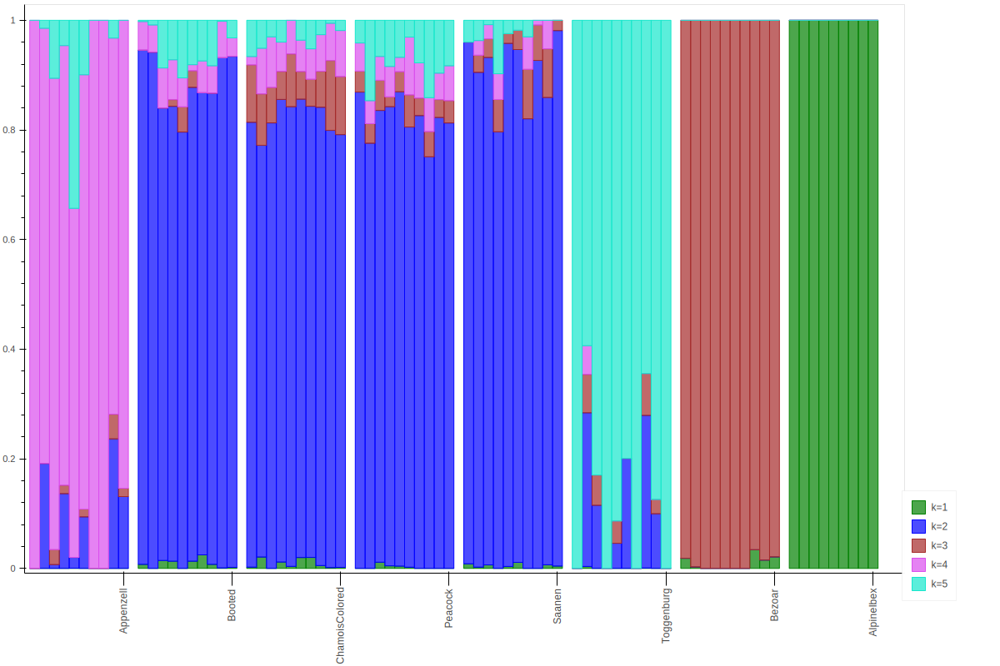
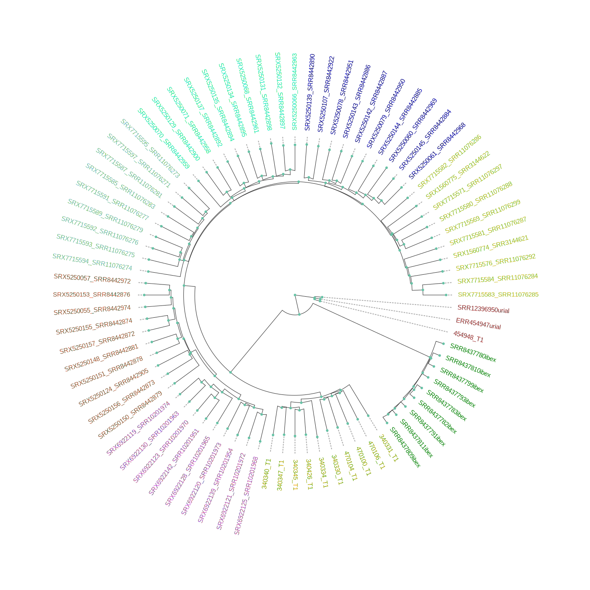
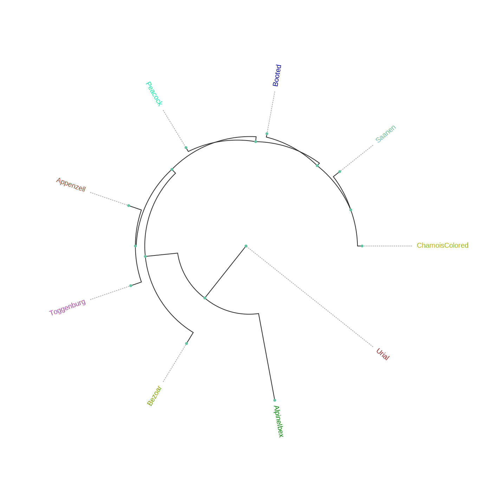

## scalepopgen: PCA, ADMIXTURE analysis, IBS- and Fst-based clustering

This sub-workflow carried out Admixture analysis, two different Principal Component Analyses, and clustering based on Identity by State distances and Fst . The first PCA is done with the function SmartPCA of the [EIGENSOFT](https://github.com/chrchang/eigensoft/tree/master/POPGEN) software and performed with the argument ```run_smartpca```. The second one is done by using the function snpgdsPCA inside the R package [SNPRelate](https://code.bioconductor.org/browse/SNPRelate/RELEASE_3_17/) and can be invoked with the argument ```run_gds_pca```. Analysis with the program [Admixture](https://dalexander.github.io/admixture/) are carried out with the argument ```admixture```.  Both clustering are done with [Plink](https://www.cog-genomics.org/plink/2.0/) calculations of Fst and IBS.

## Description of the parameters:
```genetic_structure```: setting this to false will not run this sub-workflow \
```ld_filt```: an option to use LD-based filtering according to parameters specified below, meaning to include or skip step 4\
```ld_window_size```: a window size in variant count or kilo bases (step 4)\
```ld_step_size```: number of variants to shift the window at the end of each step (step 4)\
```r2_value```: squared correlation threshold; at each step, only pairs of variants with r2 greater than the threshold are recognized (step 4)\
```structure_remove_indi```: the name of a file with listed samples that will be removed in **all analyses** of this sub-workflow\
```smartpca_param```: the path to the file with additional parameters for SmartPCA (step 6)\
```pop_color_file```: the path to the text file with specified color codes for each population (steps 7, 9, 10 and 11)\
```f_pop_marker```: the path to the text file with specified marker shapes for each population (steps 7 and 9)\
```pca_yml```: the path to the yml file containing the parameters to plot interactive PCA results (steps 7 and 9)\
```starting_k_value```: starting number of clusters for Admixture analysis (step 12)\
```ending_k_value```: maximal number of clusters for Admixture analysis (step 12)\
```cross_validation```: the number of folds for cross-validation (step 13)\
```termination_criteria```: the lowest limit of the log-likelihood change between iterations to stop the process of cross-validation (step 13), option "-C" in program Admixture\
```plot_pop_order```: the path to the text file with population IDs in order they should be plotted on admixture graph (step 14)\
```fst_based_nj_tree```: an option to estimate NJ tree based on pairwise Fst distances between each pair of populations (step 10)\
```fst_nj_yml```: the path to the yml file containing parameters of plotting interactive NJ tree based on Fst (step 10)\
```est_1_min_ibs_based_nj_tree```: an option to estimate NJ tree based on 1-ibs distance between each pair of samples in the dataset (step 11)\
```ibs_nj_yml```: the path to the yml file containing parameters of plotting interactive NJ tree based on 1-ibs (step 11)

## Overview of the processed carried out in this sub-workflow: 

**1.** converting vcf to bed file format using Plink \
**2.** merging converted bed files (separated by chromosomes) with Plink \
**3.** removing listed individuals \
**4.** applying LD-based filtering of bed files with Plink \
**5.** updating chromosome names from strings to integer numbers \
**6.** running PCA with SmartPCA \
**7.** plotting the results of SmartPCA \
**8.** running PCA with snpgdsPCA \
**9.** plotting the results of snpgdsPCA \
**10.** calculating pairwise Fst and plot NJ-based tree\
**11.** calculating IBS distances and plot NJ-based tree \
**12.** running admixture from the starting and ending k-value selected by the user  \
**13.** selecting the optimal number of clusters (K) regarding the lowest cross validation error  \
**14.**  plotting the admixture results and generating Pong input 

> **Note:** If your input files are already in Plink format, it will skip the steps 1 and 2. Also, if the LD-based filtering is set to true, all the analyses will be carried out using LD-based pruned dataset. 

## Validation and test-run of the sub-workflow:
For workflow validation, we have downloaded publicly available samples (see map below) with whole genome sequences from NCBI database (Alberto et al., 2018; Grossen et al., 2020; Henkel et al., 2019). We included domestic goats (*Capra hircus*) represented by various breeds from Switzerland. In addition to them, we also included Alpine ibex (*C. ibex*) and Bezoar wild goat (*C. aegagrus*). Since we need an outgroup when performing some of the analyses, we also added Urial sheep (*Ovis vignei*). We will use variants from chromosome 28 and 29 of, all together, 85 animals.


Geographic map of samples used for the testing and validation purpose

 <font size="2">Alberto et al. (2018). Convergent genomic signatures of domestication in sheep and goats. *Nature communications*, https://doi.org/10.1038/s41467-018-03206-y \
Grossen et al. (2020). Purging of highly deleterious mutations through severe bottlenecks in Alpine ibex. *Nature communications*, https://doi.org/10.1038/s41467-020-14803-1 \
Henkel et al. (2019). Selection signatures in goats reveal copy number variants underlying breed-defining coat color phenotypes. *PLoS genetics*, https://doi.org/10.1371/journal.pgen.1008536
 </font>

### 1. Required input data files
The input data should be in the VCF or PLINK binary format files.

All VCF files need to be splitted by the chromosomes and indexed with tabix. Please check *test_files/test_input_vcf.csv* or the example below, where, in our case, we inserted the link to the cloud stored data. The first information in each row of input file is chromosome id, next is path/to/the/file.vcf.gz and the last is path/to/the/file.vcf.gz.tbi. Please note that the chromosome id must not contain any punctuation marks.
```
chr28,https://data.cyverse.org/dav-anon/iplant/home/maulik88/28_filt_samples.vcf.gz,https://data.cyverse.org/dav-anon/iplant/home/maulik88/28_filt_samples.vcf.gz.tbi
chr29,https://data.cyverse.org/dav-anon/iplant/home/maulik88/29_filt_samples.vcf.gz,https://data.cyverse.org/dav-anon/iplant/home/maulik88/29_filt_samples.vcf.gz.tbi
```
In addition to the VCF input format, it is also necessary to prepare a sample map file of individuals and populations. Sample map has two tab-delimited columns: in the first column are individual IDs and in the second are population IDs as demonstrated on the example below. It is also important that the name of the file ends with ".map".
```
SRR8437780ibex	AlpineIbex
SRR8437782ibex	AlpineIbex
SRR8437783ibex	AlpineIbex
SRR8437791ibex	AlpineIbex
SRR8437793ibex	AlpineIbex
SRR8437799ibex	AlpineIbex
SRR8437809ibex	AlpineIbex
SRR8437810ibex	AlpineIbex
SRR8437811ibex	AlpineIbex
SRX5250055_SRR8442974	Appenzell
SRX5250057_SRR8442972	Appenzell
SRX5250124_SRR8442905	Appenzell
SRX5250148_SRR8442881	Appenzell
SRX5250150_SRR8442879	Appenzell
SRX5250151_SRR8442878	Appenzell
SRX5250153_SRR8442876	Appenzell
SRX5250155_SRR8442874	Appenzell
SRX5250156_SRR8442873	Appenzell
SRX5250157_SRR8442872	Appenzell
340330_T1	Bezoar
340331_T1	Bezoar
340334_T1	Bezoar
340340_T1	Bezoar
340345_T1	Bezoar
340347_T1	Bezoar
340426_T1	Bezoar
470100_T1	Bezoar
470104_T1	Bezoar
470106_T1	Bezoar
...
454948_T1	Urial
ERR454947urial	Urial
SRR12396950urial	Urial
```
For the Plink binary input, user need to specify the path to the BED/BIM/FAM files in the section of general parameters:
```input= "path/to/the/files/*.{bed,bim,fam}"```
### 2. Optional input data files
In this module, the samples that should be removed in given analyses (```structure_remove_indi```) can be provided. For example, during the filtering (in the earlier step of sub-workflow), the samples of Grigia goat breed were removed (```rem_indi```). Here, for the PCA and admixture, all samples of the outgroup will be excluded. A space/tab-delimited text file with population IDs in the first column and sample IDs in the second column should be provided (*test_files/remove_outgroup.txt*):
```
Urial 454948_T1
Urial ERR454947urial
Urial SRR12396950urial
```
The desired colors and mark shapes for each population can also be provided for the PCA plotting. For example, ```pop_color_file```, a tab-delimited text file, where the population names are in the first column and specified hex color codes in the second *test_files/pop_colorPCA.txt*:
```
AlpineIbex	#008000
Appenzell	#ff5733
Booted	#0000FF
ChamoisColored	#d6b919
Peacock	#16e7cc
Saanen	#75baf3
Toggenburg	#da4eed
Bezoar	#FFA500
```
Similarly, prepare another file for ```f_pop_marker``` with specified marker shapes that are listed in **./extra/markershapes.txt**. Here is the example of *test_files/pop_shape.txt*:
```
AlpineIbex	square_default
Appenzell	circle_default
Booted	circle_default
ChamoisColored	circle_default
Peacock	circle_default
Saanen	circle_default
Toggenburg	circle_default
Bezoar	triangle_default
```
Additionally, we will like to plot admixture results in a certain order of populations (```plot_pop_order```). For that, we need to prepare a text file with ordered population IDs in one column *test_files/pop_order.txt*:
```
Appenzell
Booted
ChamoisColored
Peacock
Saanen
Toggenburg
Bezoar
AlpineIbex
```
In the case of PCA with the program SmartPCA, you can also provide your own file with optional parameters (```smartpca_param```). Please, make one according to the [instructions of the EIGENSOFT software](https://github.com/chrchang/eigensoft/tree/master/POPGEN).

This workflow also has an option to draw a geographic map with samples' origin. For that, we need to provide two files with coordinates (```f_pop_cord```) and colors (```f_pop_color```). In the first one (*test_files/geo_data.txt*), we write down population IDs in the first column and comma separated latitudes and longitudes in second column.
```Bezoar	32.662864436650814,51.64853259116807
Urial	34.66031157,53.49391737
AlpineIbex	46.48952713,9.832698605
ChamoisColored	46.620927266181674,7.345747305114329
Appenzell	47.33229709563813,9.401363933224248
Booted	47.426361052956736,9.384330852599533
Peacock	46.321661051197026,8.804738507288173
Toggenburg	47.358160245764715,9.01070577172017
Grigia	46.24935612558498,8.700996940189137
Saanen	46.9570926960748,8.205509946726016
```
In the second file, we specified the hex codes of colors that will represent each population (*test_files/pop_color.txt*).

```AlpineIbex	#008000
Appenzell	#ff5733
Booted	#0000FF
ChamoisColored	#d6b919
Grigia	#aee716
Peacock	#16e7cc
Saanen	#75baf3
Urial	#A52A2A
Toggenburg	#da4eed
Bezoar	#FFA500
```
The last file is not obligatory as the tool can choose random colors, while the first one with coordinates is necessary for map plotting.

### 3. Setting the parameters
At the beginning, we have to specify some of the general parameters, which can be found in the first tab of GUI (**general_param**): \
```input```: path to the .csv input file for the VCF format or names of the PLINK binary files;\
```outDir```: the name of the output folder;\
```sample_map```: path to the file with the suffix ".map" that have listed individuals and populations as addition to VCF input;\
```concate_vcf_prefix```: file prefix of the genome-wise merged vcf files;\
```geo_plot_yml```: path to the yaml file containing parameters for plotting the samples on a geographical map;\
```tile_yml```: path to the yaml file containing parameters for the geographical map to be used for plotting;\
```f_chrom_len```: path to the file with chromosomes' length for the Plink binary inputs;\
```f_pop_cord```: path to the file with geographical locations for map plotting;\
```f_pop_color```: path to the file with specified colors for map plotting;\
```fasta```: the name of the reference genome fasta file that will be used for converting in case of PLINK input;\
```allow_extra_chrom```: set to true if the input contains chromosome name in the form of string;\
```max_chrom```: maximum number of chromosomes;\
```outgroup```: the population ID of the outgroup;\
```cm_to_bp```: the number of base pairs that corresponds to one cM

When we have filled in all the general parameters, we can move to the tab **genstruct_params** dedicated to the PCA, Admixture and both NJ clustering analyses, where we specify parameters described at the beginning of this documentation. At the end, save the parameters as yml file. 

After setting all parameters and exporting them as yml file, we are ready to start the workflow. Choose any profile, we prefer mamba, and set the maximum number of processes, 10 in our case, that can be executed in parallel by each executor. From within the **scalepopgen** folder, execute the following command:
```
nextflow run scalepopgen.nf  -params-file gen_struct.yml -profile mamba -qs 10
```
You can check all the other command running options with the option help :
```
nextflow run scalepopgen.nf -help
```
If the module analyses are processed successfully, the command line output is looking like this:
```
N E X T F L O W  ~  version 23.04.1
Launching `scalepopgen.nf` [big_swirles] DSL2 - revision: 9f9aaad1d2
executor >  slurm (10)
[26/3c186e] process > GENERATE_POP_COLOR_MAP (generating pop color map)                                          [100%] 1 of 1 ✔
[33/cca7ac] process > PLOT_GEO_MAP (plotting_sample_on_map)                                                      [100%] 1 of 1 ✔
[27/5137ac] process > CONVERT_FILTERED_VCF_TO_PLINK:CONVERT_VCF_TO_BED (converting_vcf_to_bed_CHR29)             [100%] 2 of 2 ✔
[0c/af2851] process > CONVERT_FILTERED_VCF_TO_PLINK:MERGE_BED (merging_bed_goats)                                [100%] 1 of 1 ✔
[d8/740abc] process > EXPLORE_GENETIC_STRUCTURE:REMOVE_INDI_STRUCTURE (remove_indi_pca_goats)                    [100%] 1 of 1 ✔
[2d/1ba3a8] process > EXPLORE_GENETIC_STRUCTURE:LD_FILTER_STRUCTURE (ld_filtering_goats_rem_indi)                [100%] 1 of 1 ✔
[56/e7e488] process > EXPLORE_GENETIC_STRUCTURE:UPDATE_CHROM_IDS (updating_chrom_ids)                            [100%] 1 of 1 ✔
[7d/fceb05] process > EXPLORE_GENETIC_STRUCTURE:RUN_SMARTPCA (running_smartpca_goats_rem_indi_ld_filtered_upd... [100%] 1 of 1 ✔
[66/231574] process > EXPLORE_GENETIC_STRUCTURE:PLOT_SMARTPCA (plot_interactive_pca)                             [100%] 1 of 1 ✔
[7b/2561e0] process > EXPLORE_GENETIC_STRUCTURE:RUN_SNPGDSPCA (running_snpgdspca_goats_rem_indi_ld_filtered_u... [100%] 1 of 1 ✔
[6e/5c3380] process > EXPLORE_GENETIC_STRUCTURE:PLOT_SNPGDSPCA (plot_interactive_pca)                            [100%] 1 of 1 ✔
[75/0f8471] process > EXPLORE_GENETIC_STRUCTURE:CALC_PAIRWISE_FST (ld_filtering_goats_rem_indi_ld_filtered)      [100%] 1 of 1 ✔
[cd/67a405] process > EXPLORE_GENETIC_STRUCTURE:CALC_1_MIN_IBS_DIST (1_min_ibs_distance_goats_rem_indi_ld_fil... [100%] 1 of 1 ✔
[01/dfc42f] process > EXPLORE_GENETIC_STRUCTURE:RUN_ADMIXTURE_DEFAULT (run_admixture_5)                          [100%] 9 of 9 ✔
[7a/ae5112] process > EXPLORE_GENETIC_STRUCTURE:EST_BESTK_PLOT (estimating_bestK)                                [100%] 1 of 1 ✔
[44/e127c9] process > EXPLORE_GENETIC_STRUCTURE:GENERATE_PONG_INPUT (generating_pong_input)                      [100%] 1 of 1 ✔
Completed at: 09-Aug-2023 13:56:31
Duration    : 5m 52s
CPU hours   : 2.8
Succeeded   : 25
```

### 4. Description of the output files generated by this sub-workflow:
The results are stored in the folder **./genetic_structure** and inside we have subfolders of each PCA, Admixture and interactive plots. In subfolder **/plink** are stored files after modifying and filtering steps.



Each PCA has its own folder with eigenvectors and eigenvalues:




Folder admixture contains Q-matrices for each K value together with interactive plot of optimal K:


Interactive plots of  PCA and both NJ trees are stored here:




Let's take a look at the PCA plots first. On both of them our samples cluster into three groups. In the first one we can found all breeds of domestic goats from Switzerland. In another cluster are Alpine ibexes and in the third one are Bezoar wild goats.



Figure 1: Interactive plots of both Principal Component Analyses

Program Admixture estimated the optimal number of clusters at five. As we can see on Figure 2, four Swiss goats (Booted, Chamois colored, Peacock and Saanen) are showing very similar genomic structures. Appenzell and Toggenburg goat breeds have distinct and more homogeneous structures with some individual goats that share segments with other breeds from Switzerland. Both wild species, Alpine ibex and Bezoar, have uniform genetic structures.


Figure 2: Population structures of our dataset

The NJ tree of IBS-based (Figure 3) distances positioned the branches of Swiss goats according to their breeds. Alpine ibexes and Bezoar wild goats formed their own clade, inside of which we can see clear distinction between the two species. According to that distribution was also the layout of Fst-based NJ tree (Figure 4), but, unlike the IBS-based tree, here we have population'  divergence.


Figure 3: A neighbor-joining tree constructed with matrix of IBS distances between individuals


Figure 4: A neighbor-joining tree constructed with Fst distances between populations


### 5. Generating the interactive plots without running the workflow
For generating the interactive PCA plot only (without re-running the workflow), one can use the following command: 
```
python3 plot_interactive_pca.py <eigenvect_file> <eigenval_file> pop_markershape_col.txt pca.yml <output_prefix>
```
The python script is located in the bin folder of scalepopgen. **<eigenvect_file>** and **<eigenval_file>** are located in the respective output folders of smartpca and gds_pca. The yaml file is located in "/parameters/plots/" folder. **pop_markershape_col.txt** is located in the folder of "interactive_plots/pca/" or one can also create this tab-delimited file with this format: the first column is pop_id, the second column is shape_id, the third column is hex color code. Refer to "./extra/markershapes.txt" to see the list of shapes implemented in this bokeh-dependent python script. The parameters of the yaml files are described below:
```
 plot_width: plot-width size in pixel
 plot_height: plot-height size in pixel
 pc_x_to_plot: which pc to plot on the x-axis
 pc_y_to_plot: which pc to plot on the y-axis
 fill_alpha: fill-color intensity 
 line_alpha: line-color intensity
 marker_size : size of the markers to be plotted; input should be boolean; True or False
 show_sample_label: whether or not to show the sample label for each dot during hovering. 
```
> **Note:** For plotting large number of samples and populations, increase the plot_width and plot_height size, reduce the marker_size and set show_sample_label to false.

Next, the admixture plot can be also generated with the following command: 
```
python3 plot_interactive_q_mat.py -q <Q_matrix_file> -f <plink_fam_file> -y admixture.yml -c color.txt -o <output_prefix> -s plot_pop_order.txt
```
The python script located in the bin folder of scalepopgen. **<Q_matrix_file>** is located in the respective output folder of admixture. The file <plink_fam_file> is located in folder **./plink/update_chrom_ids/*.fam**. Text files **color.txt** and **plot_pop_order.txt** can be created by the user. File **color.txt** has hex color codes listed in one column:
```
#FF0000
#00FF00
#0000FF
#FFFF00
#FF00FF
#00FFFF
#FFA500
#800080
#008000
#800000
```
Similarly, in file **plot_pop_order.txt** population IDs are listed in one column according to the order they should be plotted:
```
Appenzell
Booted
ChamoisColored
Peacock
Saanen
Toggenburg
Bezoar
AlpineIbex
```
The yaml file **admixture.yml** is located in "/parameters/plots/" and contains parameters described below:
```
 width: plot-width size in pixel
 height: plot-height size in pixel
 bar_width: the width of each sample bar
 sample_label_orientation: degrees of anlge at which the sample labels should be written
 pop_label_orientation: degrees of anlge at which the population labels should be written
 space_pop_group: the width of space between populations
 legend_font_size: font size of the legend
 num_legend_per_col: number of different K per column
 label_font_size: font size of the labels
 fil_alpha: fill-color intensity 
```

For generating the IBS-dist interactive NJ trees, one can use the following command:
```
python3 make_ibs_dist_nj_tree.py -r <outgroup> -i <square_mat_mdist_file> -m <mdist.id_file> -c pop_sc_color.map -y ibs_nj.yml -o <output_prefix>
```
The python script is located in the bin folder of scalepopgen. **<outgroup>** refers to the population to be used for rooting the tree, **<square_mat_mdist_file>** refers to the square matrix of 1-ibs distance between pairwise samples and generated by plink1.9, **<mdist.id_file>** refers to id file generated along with the square matrix by plink1.9, **pop_sc_color.map* is the tab-delimited file containing the first column as pop_id, second column as sample size and the third column as hex color code. Also generated by the workflow and saved in the output folder as **pop_sc_color.map**. The yml file is located in "parameter/plots/" folder. The parameter of the yml files are described below:
```
 width: plot-width size in pixel
 height: plot-height size in pixel
 layout: the tree layout, valid options: 'c','r','d', for circular, right and down layout of the tree
 tip_label_align: whether or not to align the tip labels; input should be boolean; True or False
 tip_label_font_size: the font size of the tip labels, default: "12px"
 edge_widths: the width of edges, default: 1
 node_sizes: the size of nodes, default:6
 node_hover: whether or not to show details info of the node while hovering; input should be boolean; True or False
```
The python script can also be run directly using the file containing tree in newick format. For more details run:```python3 make_ibs_dist_nj_tree.py -h```. As the python script is dependent on Toytree, for more details of these parameters, refer to [Toytree](https://toytree.readthedocs.io/en/latest/) documentation.

For generating the Fst-based NJ tree, one can use the following command:
```
python3 make_fst_dist_nj_tree.py -i <fst_summary_file_generated_by_plink2> -r <outgroup> -o <output_prefix> -y fst_nj.yml -c pop_sc_color.map
``` 

## References
Please cite the following papers if you use this sub-workflow in your study:

[1] Alexander, D. H., Novembre, J., & Lange, K. (2009). Fast model-based estimation of ancestry in unrelated individuals. Genome research, 19(9), 1655-1664. https://doi.org/10.1101/gr.094052.109

[2] Patterson, N., Price, A. L., & Reich, D. (2006). Population structure and eigenanalysis. PLoS genetics, 2(12), e190. https://doi.org/10.1371/journal.pgen.0020190

[3] Price, A. L., Patterson, N. J., Plenge, R. M., Weinblatt, M. E., Shadick, N. A., & Reich, D. (2006). Principal components analysis corrects for stratification in genome-wide association studies. Nature genetics, 38(8), 904-909. https://doi.org/10.1038/ng1847

[4] Zheng, X., Levine, D., Shen, J., Gogarten, S. M., Laurie, C., & Weir, B. S. (2012). A high-performance computing toolset for relatedness and principal component analysis of SNP data. Bioinformatics (Oxford, England), 28(24), 3326-3328. https://doi.org/10.1093/bioinformatics/bts606

[5] Francis, R. M. (2017). pophelper: an R package and web app to analyse and visualize population structure. Mol Ecol Resour, 17: 27–32. doi:10.1111/1755-0998.12509

[6] Huerta-Cepas, J. et al.,(2016). ETE 3: Reconstruction, Analysis, and Visualization of Phylogenomic Data, Molecular Biology and Evolution, Volume 33, Issue 6, June 2016, Pages 1635–1638, https://doi.org/10.1093/molbev/msw046.

[7] Eaton, Deren. (2019). Toytree: A minimalist tree visualization and manipulation library for Python. Methods in Ecology and Evolution. 11. 10.1111/2041-210X.13313. 

[8] Di Tommaso, P., Chatzou, M., Floden, E. et al. Nextflow enables reproducible computational workflows. Nat Biotechnol 35, 316-319 (2017). https://doi.org/10.1038/nbt.3820

## License

MIT

