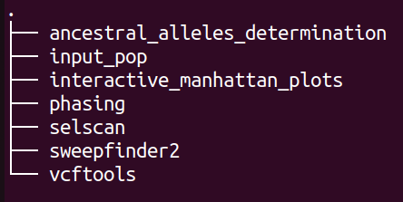
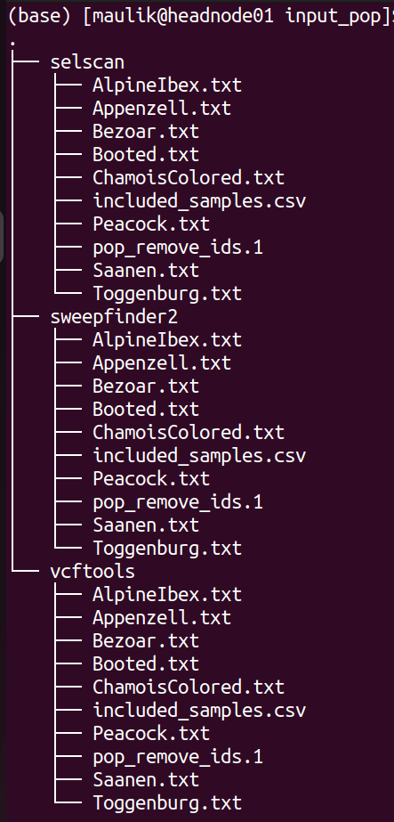
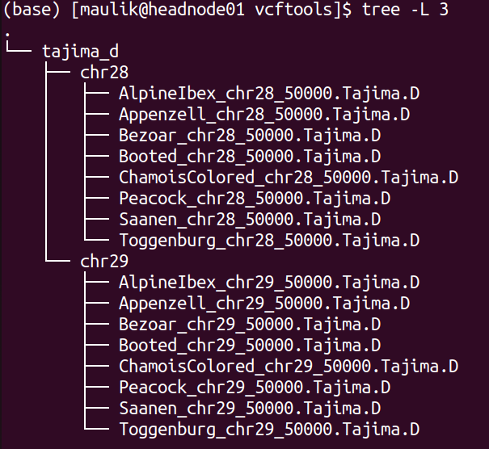
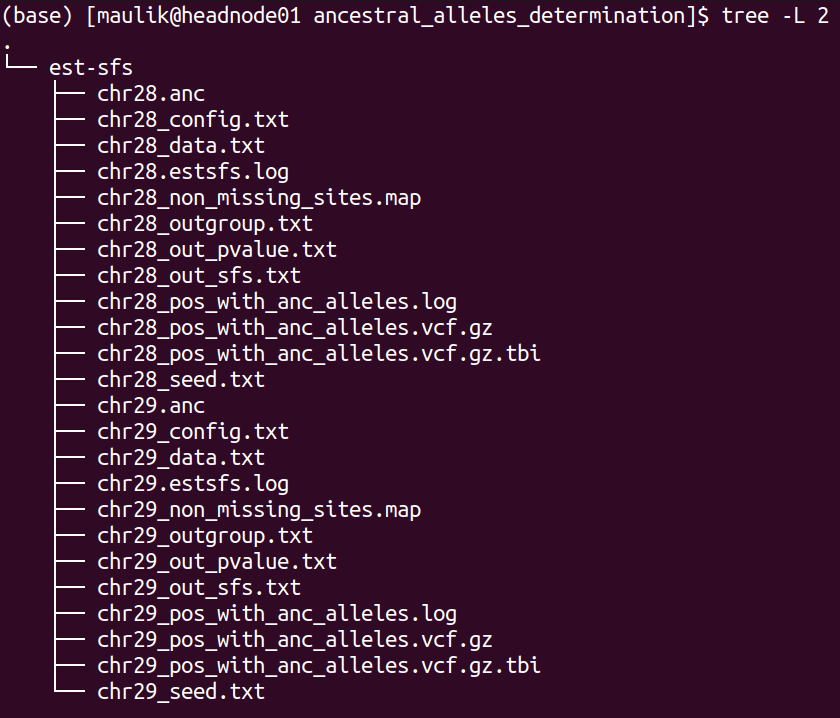
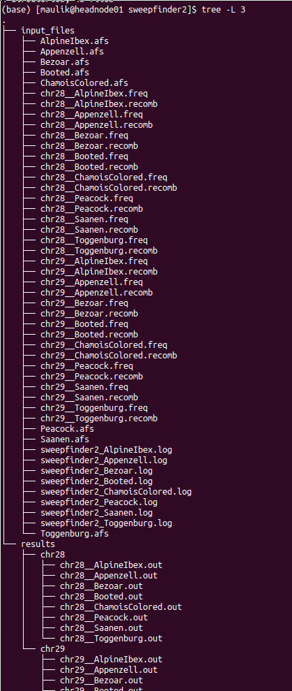
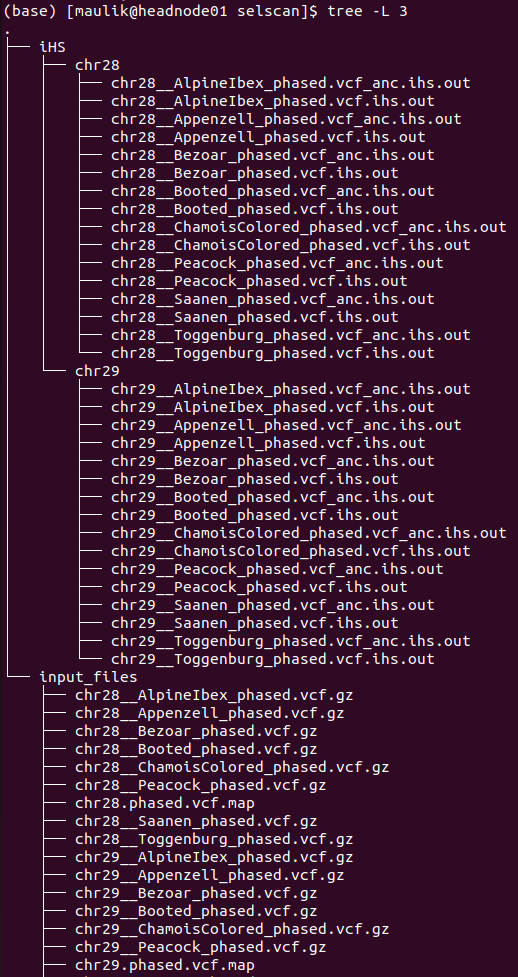
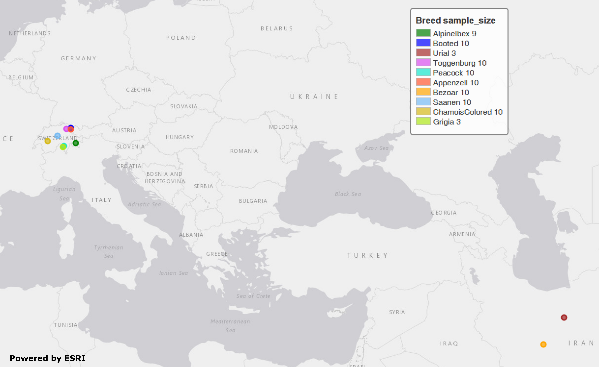

<h2 id="scalepopgen-signatures-of-selection">scalepopgen: signatures of selection</h2>
<p>This sub-workflow is intended for genome-wide detection of signatures of selection based on phased and unphased data. It can be enabled with the argument: <code>sig_sel = true</code> . It has following methods :</p>
<ul>
<li>pairwise Wright’s fixation index (Fst) as implemented in VCFtools (v 0.1.16)</li>
<li>Tajima’s D as implemented in VCFtools (v 0.1.16)</li>
<li>nucleotide diversity (pi) as implemented in VCFtools (v 0.1.16)</li>
<li>composite likelihood ratio (CLR) as implemented in SweepFinder2 (v 1.0)</li>
<li>integrated haplotype score (iHS) as implemented in selscan (v 1.2.0a)</li>
<li>cross-population extended haplotype homozygosity (XP-EHH) as implemented in selscan (v 1.2.0a)</li>
</ul>
<h2 id="description-of-the-options-and-parameters">Description of the options and parameters:</h2>
<p>Following options require boolean parameter as an input, meaning, either “true” or “false” (<em><strong>default</strong></em> is <em><strong>false</strong></em>).</p>
<p><code>sig_sel</code> : setting this to “false” will not run this entire workflow.<br>
<code>skip_sel_outgroup</code>: an option to skip the outgroup when applying  signatures of selection.<br>
<code>tajimas_d</code>:  whether or not to calculate Tajima’s D.<br>
<code>pi</code>: whether or not to calculate nucleotide diversity measure, pi.<br>
<code>pairwise_fst</code>: whether or not to calculate pairwise Fst in windows or for each SNP in every possible pair of populations.<br>
<code>single_vs_all_fst</code> : if this option is set to true, then the workflow will take one population at a time as one member of the pair and the remaining samples in the dataset as another member of the pair to calculate pairwise Fst.<br>
<code>skip_chrmwise</code>: an option relevant only for the methods implemented in VCFtools; setting this to true will calculate Fst, Tajima’s D and pi for each population after concatenating all chromosome-wise vcf files into one genome-wide vcf file per population.<br>
<code>clr</code>:  whether or not to calculate CLR.<br>
<code>use_precomputed_afs</code>:  selective sweeps with pre-computed empirical spectrum, option “-l” in SweepFinder2.<br>
<code>skip_phasing</code>: setting this to false will skip phasing the data for the analyses with selscan, meaning that the workflow assumed that the supplied vcf files are already phased.<br>
<code>impute_status</code>: an option to impute the missing genotypes (the reference vcf file need to be provided for that), option “impute” in Beagle.<br>
<code>ihs</code>:  whether or not to calculate iHS.<br>
<code>xpehh</code> : whether or not to calculate XP-EHH.</p>
<p>Following options require file path or string as an input (<em><strong>default</strong></em> is <em><strong>none</strong></em>).</p>
<p><code>skip_pop</code>: the path to the text file containing population IDs that will be skipped from all the analyses implemented in this sub-workflow.<br>
<code>ref_vcf</code>:  the path to the csv file with these two columns: chromosome ID and the path to its respective reference file in vcf format which will be used for imputation and phasing, option “ref” in Beagle. For reference, refer to this example file <em>test_files/test_reference_imputation_panel.csv</em>. <br>
<code>anc_files</code>: in case of SweepFinder2 or selscan, including the information about ancestral and derived allele increases power of the analyses, by invoking this option it is possible to include this information. It takes any of these three parameters: (i) “create”: supplying this string as parameter will invoke the process (described in the next section) of detecting ancestral alleles using the outgroup samples present in the vcf files; (ii). “none”: supplying this string as parameter will perform selscan and SweepFinder2 analyses without considering information about ancestral alleles; (iii). if none of the “create” or “none” is supplied, then the parameter is assumed to be the path to the csv file having these two columns: chromosome ID and the path to its respective space separated file containing information about ancestral alleles. For reference, refer to these example files:<br>
<code>ihs_args</code>: <a href="https://github.com/szpiech/selscan/blob/master/manual/selscan-manual.pdf">optional parameters</a> that can be applied to iHS computation.<br>
<code>xpehh_args</code> : <a href="https://github.com/szpiech/selscan/blob/master/manual/selscan-manual.pdf">optional parameters</a> that can be applied to XP-EHH computation.<br>
<code>selscan_map</code>: by invoking this option, it is possible to include recombination map in SweepFinder2 analysis. It takes any of these three parameters: (i). path to the csv file having these two columns: chromosome ID and the path to its respective recombination map; (ii). “default”: create map file with genetic and physical positions for each variant site using default conversion (1 cM = 1 Mbp); (iii). “none”: the information about recombination map will not be considered in SweepFinder2 analyses.<br>
<code>cm_map</code>:  an option to provide a path to the csv file having these two columns: chromosome ID and the path to its respective PLINK formated genetic map with cM units, option “map” in Beagle.<br>
<code>use_recomb_map</code>: selective sweeps with pre-computed empirical spectrum and recombination map, option “-lr” in SweepFinder2. This argument takes any of these three options: (i). if set to “default”, the workflow will create an input file with recombination rates assuming 1cM = 1Mbp; (ii). if set to “none”, the SweepFinder2 analysis will be run without recombination map file; (iii), if it is neither “default” nor “none”, the third option is path to the csv file having these two columns: chromosome ID and the path to its respective recombination map file in the format as recognized by SweepFinder2.</p>
<p>Following arguments require integer as an input.</p>
<p><code>min_samples_per_pop</code>: minimum sample size of the population to be used in the analyses. Default: 2<br>
<code>tajimasd_window_size</code>: the desired window size for Tajima’s D calculation. Default: 50000<br>
<code>fst_window_size</code>: the desired window size for pairwise Fst calculation. Default: 50000<br>
<code>fst_step_size</code>: the desired step size between windows for Fst calculation. Default: -9. Any value greater or equal to zero means that window and step size are equal.<br>
<code>pi_window_size</code>: the desired window size for pi calculation. Default: 50000.<br>
<code>pi_step_size</code>: the desired step size between windows for pi calculation. Default: -9. Any value greater or equal to zero means that window and step size are equal.<br>
<code>grid_space</code>: the spacing in number of nucleotides between grid points, option “g” in SweepFinder2. Default: 50000<br>
<code>grid_points</code>: the number of points equally spaced across the genome, option “G” in SweepFinder2. Default: -9. Any value greater than zero will carry out SweepFinder2 analyses with <code>grid points</code> and ignore the value specified in <code>grid space</code>.<br>
<code>burnin_val</code>: the maximum number of burnin iterations, option “burnin” in Beagle. Default: 3<br>
<code>iterations_val</code>: the number of iterations, option “iterations” in Beagle. Default: 12<br>
<code>ne_val</code>: the effective population size, option “ne” in Beagle. Default: 10000000</p>
<h2 id="overview-of-the-processed-carried-out-in-this-sub-workflow">Overview of the processed carried out in this sub-workflow:</h2>
<p>Computing iHS and XP-EHH requires phased input data while calculation of Fst, Tajima’s D, pi and CLR don’t. Following is the brief summary of the processes carried out by this sub-workflow:<br>

<strong>1.</strong> splitting individuals’ IDs by population into each separate file according to information provided in the sample map file and removing the populations that don’t satisfy the threshold of minimum sample size.</p>
<p><strong>Using VCFtools to calculate Tajima’s D, Weir’s Fst and pi</strong><br>
<strong>2.</strong> calculating Tajima’s D <br>
<strong>3.</strong> calculating pi<br>
<strong>4.</strong> calculating Fst for each population pair combination<br>
<strong>5.</strong> calculating Fst for pair combinations of population versus all other</p>
<p><strong>Detection of ancestral alleles using <a href="https://academic.oup.com/genetics/article/209/3/897/5930981?login=false">est-sfs</a></strong><br>
Analyses implemented in VCFtools do not require outgroup/ancestral alleles. In case of CLR as implemented in <a href="http://degiorgiogroup.fau.edu/Manual_SweepFinder2_v1.0.pdf">SweepFinder2</a> as well as in case of iHS and XP-EHH as implemented in <a href="https://github.com/szpiech/selscan/blob/master/manual/selscan-manual.pdf">selscan</a>, using the information of ancestral allele vs. derived allele increases the power. Therefore, if the outgroup is present in the vcf files, the following processes are carried out before applying SweepFinder2 and selscan analyses:</p>
<p><strong>6.</strong> if the outgroup samples are present in the vcf file, ancestral alleles will be detected using <a href="https://academic.oup.com/genetics/article/209/3/897/5930981?login=false">est-sfs</a>. 

> **Note:** Porgram est-sfs detect ancestral alleles only for the sites, where all samples are genotyped and not a single sample has a missing genotype at this position.

<strong>7.</strong> create a new vcf file by extracting the sites for which the program est-sfs has detected ancestral alleles.</p>
<p><strong>Using SweepFinder2 to calculate CLR</strong><br>
<strong>8.</strong> preparing input files for SweepFinder2: splitting sample map (the same as in step 1)<br>
<strong>9.</strong> preparing input files for SweepFinder2: genome wide allele frequency and recombination files with in-house Python scripts<br>
<strong>10.</strong> computing the empirical frequency spectrum with SweepFinder2<br>
<strong>11.</strong> calculating CLR with SweepFinder2</p>
<p>There are several ways of running SweepFinder2 analysis: (i). to run without recombination map and pre-computed empirical frequency spectrum (section 5.1 of SweepFinder2 manual), provide “none” to parameter <code>use_recomb_map</code> and set <code>use_precompute_afs</code>to false; (ii). to run without recombination map but with pre-computed empirical frequency spectrum (section 5.2 of the SweepFinder2 manual), provide “none” to parameter <code>use_recomb_map</code>but set <code>use_precompute_afs</code>to true; (iii). to run with both recombination map and pre-computed empirical frequency spectrum (section 5.3 of SweepFinder2 manual), either provide “default” or file path to the <code>use_recomb_map</code>and set <code>use_precompute_afs</code>to true.</p>
<p><strong>Using selscan to calculate iHS and XP-EHH</strong><br>
<strong>12.</strong> preparing input files for selscan: phasing genotypes with the program Beagle<br>
<strong>13.</strong> preparing input files for selscan: a map file specifying physical distances<br>
<strong>14.</strong> preparing input files for selscan: splitting the phased vcf files by each population<br>
<strong>15.</strong> calculating iHS<br>
<strong>16.</strong> calculating XP-EHH for each population pair</p>
<h2 id="description-of-the-output-files-and-directory-structure-generated-by-this-sub-workflow">Description of the output files and directory-structure generated by this sub-workflow:</h2>
<p>If the pipeline has completed successfully, results of it will be stored in <strong>${output directory}/selection/</strong>. Inside this directory, following directories will be created (depending on the parameters set):<br>
</p>
<p>The directory structure of <strong>“input_pop”</strong> is shown below:<br>
<br>
Each directory contains the list of population and samples included in the respective analysis.</p>
<p>The directory structure of <strong>“vcftools”</strong> is shown below:<br>
<br>
There will be one directory for each analysis performed. The screenshot above shows the directory for <strong>“tajima_d”</strong>, which stores the results of calculated Tajima’s D values. Inside, there will be a directory for each chromosome, in which are then results for each population. Likewise, if the option <code>pi</code> is set to true, there will be another directory for <strong>“pi”</strong> besides <strong>“tajima_d”</strong>.</p>
<p>The directory structure of <strong>“ancestral_alleles_determination”</strong> is shown below:<br>
<br>
There will be 12 files for each chromosome, of these six files are inputs and outputs of “ests-sfs” tool:<br>
1). *_config.txt : the configuration file containing parameters to run est-sfs<br>
2). *_data.txt : the data file<br>
3). *_seed.txt: the text file containing positive integer value<br>
4). *_out_sfs.txt: the output file containing estimated uSFS vector.<br>
5). *_out_pvalue.txt: the output file containing the estimated ancestral state probabilities for each site.<br>
6). *_estsfs.log: the log file of est-sfs.</p>
<p>For detailed description of these files, refer to the manual of <a href="https://sourceforge.net/projects/est-usfs/">est-sfs</a>.</p>
<p>The description of the remaining six files are as follows:<br>
7). *_non_missing_sites.map: this text file contains three columns: chromsome ID, position, and the information about the major allele. If the major allele is based on the reference, then code in the third column will be 0 else it will be 1 (the major allele is alternative allele).<br>
8). *_outgroup.txt: information about population used as outgroup<br>
9). *.anc: the text file containing information about ancestral alleles. This text file will be used in the processes of selscan and SweepFinder2 analyses. It contains four columns: chromosome ID, position, ancestral allele, derived allele.  Number 0 refers to the reference allele and 1 refers to the alternative allele.<br>
10). *_pos_with_anc_alleles.vcf.gz: This vcf file contains only those positons where ancestral and derived alleles were determined. It will also be used for SweepFinder2 and selscan analyses.<br>
11). *_pos_with_anc_alleles.vcf.gz.tbi: index file of the above file <br>
12). *_pos_with_anc_alleles.log: the log file containing the commands used to generate file in steps 10 and 11.</p>
<p>The directory structure of <strong>“sweepfinder2”</strong> is shown below:<br>
</p>
<p>It contains two directories: <strong>“input_files”</strong> and <strong>“results”</strong>. Inside the <strong>“input_files”</strong> directory, there will be input files used to run SweepFinder2 analysis. Inside the <strong>“results”</strong> directory, there will be a directory for each chromosome. Inside this directory, there will be results for each population.</p>
<p>The directory structure of <strong>“selscan”</strong> is shown below:<br>
</p>
<p>There will be one directory for each performed analysis. In this example, only iHS were computed. Inside directory <strong>“iHS”</strong> are two more sub-directories:  <strong>“input_files”</strong> and <strong>“results”</strong>. In the <strong>“input_files”</strong> directory are input files used to run iHS analysis for each population as well for each chromosome. Within the <strong>“results”</strong> each chromosome has a separate directory, where are two files for every population:<br>
1). *vcf.iHS.out: this is the raw output file generated by selscan. This output is not normalized.<br>
2). *vcf_anc.iHS.out: this is the output file using the information of ancestral allele. This output is also not normalized.</p>
<h2 id="validation-of-the-sub-workflow">Validation of the sub-workflow:</h2>
<p>For workflow validation, we have downloaded publicly available samples (see map below) with whole genome sequences from NCBI database (Alberto et al., 2018; Grossen et al., 2020; Henkel et al., 2019). We included domestic goats (<em>Capra hircus</em>) represented by various breeds from Switzerland. In addition to them, we also included Alpine ibex (<em>C. ibex</em>) and Bezoar wild goat (<em>C. aegagrus</em>). Since we need an outgroup when performing some of the analyses, we also added Urial sheep (<em>Ovis vignei</em>). We will use variants from chromosome 28 and 29 of, all together, 85 animals.


Geographic map of samples used for the testing and validation purpose

 <font size="2">Alberto et al. (2018). Convergent genomic signatures of domestication in sheep and goats. *Nature communications*, https://doi.org/10.1038/s41467-018-03206-y \
Grossen et al. (2020). Purging of highly deleterious mutations through severe bottlenecks in Alpine ibex. *Nature communications*, https://doi.org/10.1038/s41467-020-14803-1 \
Henkel et al. (2019). Selection signatures in goats reveal copy number variants underlying breed-defining coat color phenotypes. *PLoS genetics*, https://doi.org/10.1371/journal.pgen.1008536
 </font>

### 1. Required input data files
The input data should be in the VCF or PLINK binary format files.

All VCF files need to be splitted by the chromosomes and indexed with tabix. Please check *test_files/test_input_vcf.csv* or the example below, where, in our case, we inserted the link to the cloud stored data. The first information in each row of input file is chromosome id, next is path/to/the/file.vcf.gz and the last is path/to/the/file.vcf.gz.tbi. Please note that the chromosome id must not contain any punctuation marks.
```
chr28,https://data.cyverse.org/dav-anon/iplant/home/maulik88/28_filt_samples.vcf.gz,https://data.cyverse.org/dav-anon/iplant/home/maulik88/28_filt_samples.vcf.gz.tbi
chr29,https://data.cyverse.org/dav-anon/iplant/home/maulik88/29_filt_samples.vcf.gz,https://data.cyverse.org/dav-anon/iplant/home/maulik88/29_filt_samples.vcf.gz.tbi
```
In addition to the VCF input format, it is also necessary to prepare a sample map file of individuals and populations. Sample map has two tab-delimited columns: in the first column are individual IDs and in the second are population IDs as demonstrated on the example below. It is also important that the name of the file ends with ".map".
```
SRR8437780ibex	AlpineIbex
SRR8437782ibex	AlpineIbex
SRR8437783ibex	AlpineIbex
SRR8437791ibex	AlpineIbex
SRR8437793ibex	AlpineIbex
SRR8437799ibex	AlpineIbex
SRR8437809ibex	AlpineIbex
SRR8437810ibex	AlpineIbex
SRR8437811ibex	AlpineIbex
SRX5250055_SRR8442974	Appenzell
SRX5250057_SRR8442972	Appenzell
SRX5250124_SRR8442905	Appenzell
SRX5250148_SRR8442881	Appenzell
SRX5250150_SRR8442879	Appenzell
SRX5250151_SRR8442878	Appenzell
SRX5250153_SRR8442876	Appenzell
SRX5250155_SRR8442874	Appenzell
SRX5250156_SRR8442873	Appenzell
SRX5250157_SRR8442872	Appenzell
340330_T1	Bezoar
340331_T1	Bezoar
340334_T1	Bezoar
340340_T1	Bezoar
340345_T1	Bezoar
340347_T1	Bezoar
340426_T1	Bezoar
470100_T1	Bezoar
470104_T1	Bezoar
470106_T1	Bezoar
...
454948_T1	Urial
ERR454947urial	Urial
SRR12396950urial	Urial
```
For the Plink binary input, user need to specify the path to the BED/BIM/FAM files in the section of general parameters:
```input= "path/to/the/files/*.{bed,bim,fam}"```
<h3 id="optional-input-data-files">2. Optional input data files</h3>
In this sub-workflow, the user can list population IDs that should be excluded in the analyses (<code>skip_pop</code>). For example, as we are only interested to investigate signatures of selection in domestic goat breeds, we excluded Alpine ibexes and Bezoar wild goats. We provided a text file with population IDs in one column: 

```
AlpineIbex
Bezoar
```

<h3 id="setting-the-parameters">3. Setting the parameters</h3>
At the beginning, we have to specify some of the general parameters, which can be found in the first tab of GUI (<strong>general_param</strong>):<br>
<code>input</code>: path to the .csv input file for the VCF format or names of the PLINK binary files;<br>
<code>outDir</code>: the name of the output folder;<br>
<code>sample_map</code>: path to the file with the suffix ".map" that have listed individuals and populations as addition to VCF input;<br>
<code>concate_vcf_prefix</code>: file prefix of the genome-wise merged vcf files;<br>
<code>geo_plot_yml</code>: path to the yaml file containing parameters for plotting the samples on a geographical map;<br>
<code>tile_yml</code>: path to the yaml file containing parameters for the geographical map to be used for plotting;<br>
<code>f_chrom_len</code>: path to the file with chromosomes' length for the Plink binary inputs;<br>
<code>f_pop_cord</code>: path to the file with geographical locations for map plotting;<br>
<code>f_pop_color</code>: path to the file with specified colors for map plotting;<br>
<code>fasta</code>: the name of the reference genome fasta file that will be used for converting in case of PLINK input;<br>
<code>allow_extra_chrom</code>: set to true if the input contains chromosome name in the form of string;<br>
<code>max_chrom</code>: maximum number of chromosomes;<br>
<code>outgroup</code>: the population ID of the outgroup;<br>
<code>cm_to_bp</code>: the number of base pairs that corresponds to one cM

When we have filled in all the general parameters, we can move to the tab **sig_sel_params**, which is intended for analysing signatures of selection. Specify here the parameters described at the beginning of this documentation. At the end, save the parameters as yml file. 

After setting all parameters and exporting them as yml file, we are ready to start the workflow. Choose any profile, we prefer mamba, and set the maximum number of processes, 10 in our case, that can be executed in parallel by each executor. From within the **scalepopgen** folder, execute the following command:
```
nextflow run scalepopgen.nf  -params-file sig_sel.yml -profile mamba -qs 10
```
You can check all the other command running options with the option help :
```
nextflow run scalepopgen.nf -help
```
If the analyses processed successfully, the command line output is looking like this:
```
N E X T F L O W  ~  version 23.04.1
Launching `scalepopgen.nf` [astonishing_torricelli] DSL2 - revision: b2755eec5b
WARN: Access to undefined parameter `help` -- Initialise it to a default value eg. `params.help = some_value`
executor >  local (44)
[2b/18f285] process > GENERATE_POP_COLOR_MAP (generating pop color map)                              [100%] 1 of 1, cached: 1 ✔
[87/2886a0] process > FILTER_SITES (filter_sites_CHR29)                                              [100%] 2 of 2, cached: 2 ✔
[48/f09ccf] process > RUN_SEL_VCFTOOLS:SPLIT_MAP_FOR_VCFTOOLS (splitting_idfile_by_pop)              [100%] 1 of 1, cached: 1 ✔
[a6/85c03d] process > RUN_SEL_VCFTOOLS:CONCAT_VCF (concate_vcf)                                      [100%] 1 of 1, cached: 1 ✔
[bc/c52fb5] process > RUN_SEL_VCFTOOLS:CALC_TAJIMA_D (calculating_tajima_d)                          [100%] 8 of 8, cached: 8 ✔
[71/d9eac6] process > RUN_SEL_VCFTOOLS:MANHATTAN_TAJIMAS_D (generating_mahnattan_plot)               [100%] 8 of 8 ✔
[6e/53befa] process > RUN_SEL_VCFTOOLS:CALC_PI (calculating_pi)                                      [100%] 8 of 8, cached: 8 ✔
[26/e512bd] process > RUN_SEL_VCFTOOLS:MANHATTAN_PI (generating_mahnattan_plot)                      [100%] 8 of 8 ✔
[d4/2b7e7c] process > RUN_SEL_VCFTOOLS:CALC_WFST (calculating_pairwise_fst)                          [100%] 28 of 28, cached: 26 ✔
[8a/46f2d5] process > RUN_SEL_VCFTOOLS:CALC_WFST_ONE_VS_REMAINING (calculating_one_vs_remaining_fst) [100%] 8 of 8, cached: 8 ✔
[24/aa8283] process > RUN_SEL_VCFTOOLS:MANHATTAN_FST (generating_mahnattan_plot)                     [100%] 8 of 8 ✔
[08/153d29] process > RUN_SEL_SWEEPFINDER2:SPLIT_FOR_SWEEPFINDER2 (splitting_idfile_by_pop)          [100%] 1 of 1, cached: 1 ✔
[d5/ae7ef7] process > RUN_SEL_SWEEPFINDER2:PREPARE_SWEEPFINDER_INPUT (sweepfinder_input_CHR28)       [100%] 16 of 16, cached: 16 ✔
[a7/aae8e6] process > RUN_SEL_SWEEPFINDER2:COMPUTE_EMPIRICAL_AFS (sweepfinder_input_Grigia)          [100%] 8 of 8, cached: 8 ✔
[02/5b5d06] process > RUN_SEL_SWEEPFINDER2:RUN_SWEEPFINDER2 (sweepfinder_input_Peacock)              [100%] 16 of 16, cached: 16 ✔
[dd/c91de1] process > RUN_SIG_SEL_PHASED_DATA:SPLIT_FOR_SELSCAN (splitting_idfile_by_pop)            [100%] 1 of 1, cached: 1 ✔
[4c/b15966] process > RUN_SIG_SEL_PHASED_DATA:PHASING_GENOTYPE_BEAGLE (phasing_CHR28)                [100%] 2 of 2, cached: 2 ✔
[23/35d715] process > RUN_SIG_SEL_PHASED_DATA:PREPARE_MAP_SELSCAN (preparing_selscan_map_CHR29)      [100%] 2 of 2, cached: 2 ✔
[fa/936a01] process > RUN_SIG_SEL_PHASED_DATA:SPLIT_VCF_BY_POP (split_vcf_by_pop_CHR29)              [100%] 2 of 2 ✔
[da/c5f1bf] process > RUN_SIG_SEL_PHASED_DATA:CALC_iHS (calculating_iHS_CHR28)                       [100%] 16 of 16, cached: 16 ✔
[cd/67a405] process > RUN_SIG_SEL_PHASED_DATA:NORM_iHS                                               [100%] 16 of 16, cached: 16 ✔
[d1/198711] process > RUN_SIG_SEL_PHASED_DATA:CALC_XPEHH (calculating_xpehh_CHR28)                   [100%] 56 of 56, cached: 56 ✔
[01/dfc42f] process > RUN_SIG_SEL_PHASED_DATA:NORM_XPEHH                                             [100%] 56 of 56, cached: 56 ✔

Completed at: 10-Sep-2023 17:36:51
Duration    : 2h 32m 41s
CPU hours   : 
Succeeded   : 
```
### 4. Description of the output:
Results are stored in the specified output folder, more precisely in the folder **selection**. In the sub-folder **interactive_manhattan_plots**, we will take a look at interactive plots of calculated Fst, pi and Tajima's D. Plots were made separatly for all included populations. For example, in the case of Saanen breed from Switzerland, we detected peaks on chromosome  29 (NC_030836) that have higher Fst values as shown in the figure below:


If we move with the pointer to one of the peaks, it will show us the link to explore this genomic region in Ensembl.
 
<h2 id="references">References</h2>
<p>Please cite the following papers if you use this sub-workflow in your study:</p>
<p>[1] Danecek, P., Auton, A., Abecasis, G., Albers, C. A., Banks, E., DePristo, M. A., Handsaker, R. E., Lunter, G., Marth, G. T., Sherry, S. T., McVean, G., Durbin, R., &amp; 1000 Genomes Project Analysis Group (2011). The variant call format and VCFtools. <em>Bioinformatics (Oxford, England)</em>, <em>27</em>(15), 2156–2158. <a href="https://doi.org/10.1093/bioinformatics/btr330">https://doi.org/10.1093/bioinformatics/btr330</a></p>
<p>[2] Keightley, P. D., &amp; Jackson, B. C. (2018). Inferring the Probability of the Derived vs. the Ancestral Allelic State at a Polymorphic Site. <em>Genetics</em>, 209(3), 897–906. <a href="https://doi.org/10.1534/genetics.118.301120">https://doi.org/10.1534/genetics.118.301120</a></p>
<p>[3] DeGiorgio, M., Huber, C. D., Hubisz, M. J., Hellmann, I., &amp; Nielsen, R. (2016). SweepFinder2: increased sensitivity, robustness and flexibility. <em>Bioinformatics (Oxford, England)</em>, 32(12), 1895–1897. <a href="https://doi.org/10.1093/bioinformatics/btw051">https://doi.org/10.1093/bioinformatics/btw051</a></p>
<p>[4] Browning, B. L., Tian, X., Zhou, Y., &amp; Browning, S. R. (2021). Fast two-stage phasing of large-scale sequence data. <em>American journal of human genetics</em>, 108(10), 1880–1890. <a href="https://doi.org/10.1016/j.ajhg.2021.08">https://doi.org/10.1016/j.ajhg.2021.08</a></p>
<p>[5] Szpiech, Z. A., &amp; Hernandez, R. D. (2014). selscan: an efficient multithreaded program to perform EHH-based scans for positive selection. <em>Molecular biology and evolution</em>, 31(10), 2824–2827. <a href="https://doi.org/10.1093/molbev/msu211">https://doi.org/10.1093/molbev/msu211</a></p>
<p>[6] Di Tommaso, P., Chatzou, M., Floden, E. W., Barja, P. P., Palumbo, E., &amp; Notredame, C. (2017). Nextflow enables reproducible computational workflows. <em>Nature biotechnology</em>, 35(4), 316–319. <a href="https://doi.org/10.1038/nbt.3820">https://doi.org/10.1038/nbt.3820</a></p>
<h2 id="license">License</h2>
<p>MIT</p>


