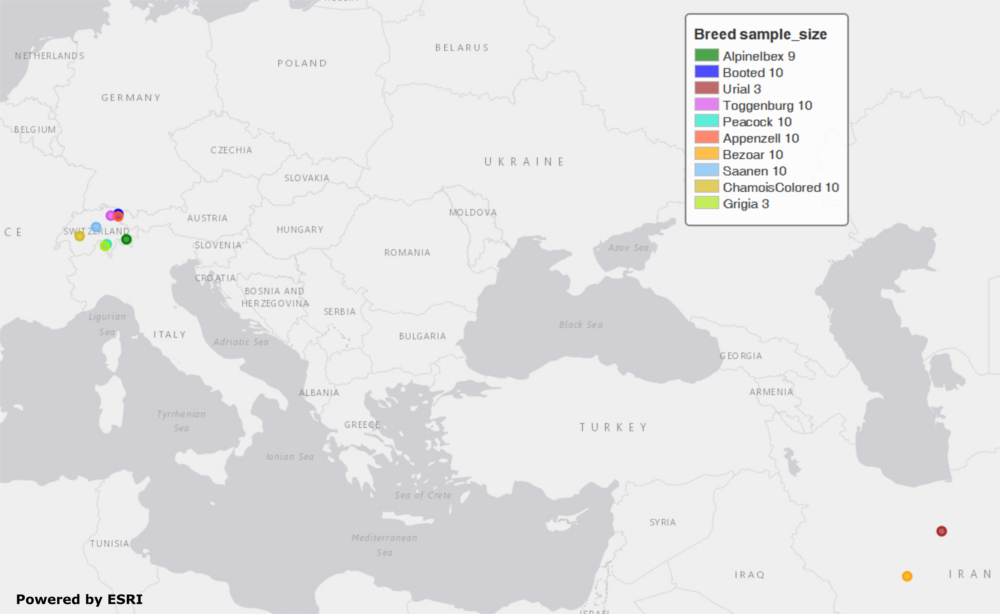

## scalepopgen: TreeMix

This sub-workflow can be invoked using the argument ```treemix```. It will construct the maximum likelihood tree based on allele frequencies and optionally infer migration events. It consists of the following steps:

## Description of the parameters:
```n_bootstrap```: number of bootstraps to be performed - if is set to 0, bootstrapping will not be performed (step 5);\
```upper_limit```: upper limit of random integer to set for different bootstrapping (step 5);\
```starting_m_value```:  the starting number of migration edges to be added to tree - if the number is set to 0, it will skip the analysis with migration edges (steps 7 and 8);\
```ending_m_value```: the maximum number of migration edges to be added to tree (steps 7 and 8);\
```n_iter```: the number of iterations to be performed for each migration edge (steps 7 and 8);\
```k_snps```: the block of SNPs to be grouped together to account for the LD in the analysis (steps 4, 5 and 7)

## Overview of the processed carried out in this sub-workflow: 

**1.** generating a file with samples and populations based on sample map provided by the user \
**2.** converting vcf to treemix input file format using python script \
**3.** merging converted treemix files (separated by chromosomes) into one \
**4.** running the treemix analysis without migration edges \
**5.** running the treemix analysis with bootstraps \
**6.** generating consensus tree out of the bootstrapped trees generated in the previous step \
**7.** the treemix analysis with migration edges \
**8.** identify optimal number of migration edges using the procedure as implemented in [OptM](https://academic.oup.com/biomethods/article/6/1/bpab017/6371180) package

> **Note:** If your input files are in Plink format, it will convert them into VCF before the first step.

## Validation and test-run of the sub-workflow::
For workflow validation, we have downloaded publicly available samples (see map below) with whole genome sequences from NCBI database (Alberto et al., 2018; Grossen et al., 2020; Henkel et al., 2019). We included domestic goats (*Capra hircus*) represented by various breeds from Switzerland. In addition to them, we also included Alpine ibex (*C. ibex*) and Bezoar wild goat (*C. aegagrus*). Since we need an outgroup when performing some of the analyses, we also added Urial sheep (*Ovis vignei*). We will use variants from chromosome 28 and 29 of, all together, 85 animals.


Geographic map of samples used for the testing and validation purpose

 <font size="2">Alberto et al. (2018). Convergent genomic signatures of domestication in sheep and goats. *Nature communications*, https://doi.org/10.1038/s41467-018-03206-y \
Grossen et al. (2020). Purging of highly deleterious mutations through severe bottlenecks in Alpine ibex. *Nature communications*, https://doi.org/10.1038/s41467-020-14803-1 \
Henkel et al. (2019). Selection signatures in goats reveal copy number variants underlying breed-defining coat color phenotypes. *PLoS genetics*, https://doi.org/10.1371/journal.pgen.1008536
 </font>
### 1. Required input data files
The input data should be in the VCF or PLINK binary format files.

All VCF files need to be splitted by the chromosomes and indexed with tabix. Please check *test_files/test_input_vcf.csv* or the example below, where, in our case, we inserted the link to the cloud stored data. The first information in each row of input file is chromosome id, next is path/to/the/file.vcf.gz and the last is path/to/the/file.vcf.gz.tbi. Please note that the chromosome id must not contain any punctuation marks.
```
chr28,https://data.cyverse.org/dav-anon/iplant/home/maulik88/28_filt_samples.vcf.gz,https://data.cyverse.org/dav-anon/iplant/home/maulik88/28_filt_samples.vcf.gz.tbi
chr29,https://data.cyverse.org/dav-anon/iplant/home/maulik88/29_filt_samples.vcf.gz,https://data.cyverse.org/dav-anon/iplant/home/maulik88/29_filt_samples.vcf.gz.tbi
```
In addition to the VCF input format, it is also necessary to prepare a sample map file of individuals and populations. Sample map has two tab-delimited columns: in the first column are individual IDs and in the second are population IDs as demonstrated on the example below. It is also important that the name of the file ends with ".map".
```
SRR8437780ibex	AlpineIbex
SRR8437782ibex	AlpineIbex
SRR8437783ibex	AlpineIbex
SRR8437791ibex	AlpineIbex
SRR8437793ibex	AlpineIbex
SRR8437799ibex	AlpineIbex
SRR8437809ibex	AlpineIbex
SRR8437810ibex	AlpineIbex
SRR8437811ibex	AlpineIbex
SRX5250055_SRR8442974	Appenzell
SRX5250057_SRR8442972	Appenzell
SRX5250124_SRR8442905	Appenzell
SRX5250148_SRR8442881	Appenzell
SRX5250150_SRR8442879	Appenzell
SRX5250151_SRR8442878	Appenzell
SRX5250153_SRR8442876	Appenzell
SRX5250155_SRR8442874	Appenzell
SRX5250156_SRR8442873	Appenzell
SRX5250157_SRR8442872	Appenzell
340330_T1	Bezoar
340331_T1	Bezoar
340334_T1	Bezoar
340340_T1	Bezoar
340345_T1	Bezoar
340347_T1	Bezoar
340426_T1	Bezoar
470100_T1	Bezoar
470104_T1	Bezoar
470106_T1	Bezoar
...
454948_T1	Urial
ERR454947urial	Urial
SRR12396950urial	Urial
```
For the Plink binary input, user need to specify the path to the BED/BIM/FAM files in the section of general parameters:
```input= "path/to/the/files/*.{bed,bim,fam}"```
### 2. Optional input data files
This workflow also has an option to draw a geographic map with samples' origin. For that, we need to provide two files with coordinates (```f_pop_cord```) and colors (```f_pop_color```). In the first one (*test_files/geo_data.txt*), we write down population IDs in the first column and comma separated latitudes and longitudes in second column.
```Bezoar	32.662864436650814,51.64853259116807
Urial	34.66031157,53.49391737
AlpineIbex	46.48952713,9.832698605
ChamoisColored	46.620927266181674,7.345747305114329
Appenzell	47.33229709563813,9.401363933224248
Booted	47.426361052956736,9.384330852599533
Peacock	46.321661051197026,8.804738507288173
Toggenburg	47.358160245764715,9.01070577172017
Grigia	46.24935612558498,8.700996940189137
Saanen	46.9570926960748,8.205509946726016
```
In the second file, we specified the hex codes of colors that will represent each population (*test_files/pop_color.txt*).
```AlpineIbex	#008000
Appenzell	#ff5733
Booted	#0000FF
ChamoisColored	#d6b919
Grigia	#aee716
Peacock	#16e7cc
Saanen	#75baf3
Urial	#A52A2A
Toggenburg	#da4eed
Bezoar	#FFA500
```
The last file is not obligatory as the tool can choose random colors, while the first one with coordinates is necessary for map plotting.

### 3. Setting the parameters
At the beginning, we have to specify some of the general parameters, which can be found in the first tab of GUI (**general_param**): \
```input```: path to the .csv input file for the VCF format or names of the PLINK binary files;\
```outDir```: the name of the output folder;\
```sample_map```: path to the file with the suffix ".map" that have listed individuals and populations as addition to VCF input;\
```concate_vcf_prefix```: file prefix of the genome-wise merged vcf files;\
```geo_plot_yml```: path to the yaml file containing parameters for plotting the samples on a geographical map;\
```tile_yml```: path to the yaml file containing parameters for the geographical map to be used for plotting;\
```f_chrom_len```: path to the file with chromosomes' length for the Plink binary inputs;\
```f_pop_cord```: path to the file with geographical locations for map plotting;\
```f_pop_color```: path to the file with specified colors for map plotting;\
```fasta```: the name of the reference genome fasta file that will be used for converting in case of PLINK input;\
```allow_extra_chrom```: set to true if the input contains chromosome name in the form of string;\
```max_chrom```: maximum number of chromosomes;\
```outgroup```: the population ID of the outgroup;\
```cm_to_bp```: the number of base pairs that corresponds to one cM

When we have filled in all the general parameters, we can move to the tab **treemix**, where we specify parameters described at the beginning of this documentation. At the end, save the parameters as yml file. 

After setting all parameters and exporting them as yml file, we are ready to start the workflow. Choose any profile, we prefer mamba, and set the maximum number of processes, 10 in our case, that can be executed in parallel by each executor. From within the **scalepopgen** folder, execute the following command:
```
nextflow run scalepopgen.nf  -params-file treemix.yml -profile mamba -qs 10
```
You can check all the other command running options with the option help :
```
nextflow run scalepopgen.nf -help
```
If the module analyses are processed successfully, the command line output is looking like this:
```N E X T F L O W  ~  version 23.04.1
Launching `scalepopgen.nf` [shrivelled_sinoussi] DSL2 - revision: 9f9aaad1d2
executor >  local (24)
[71/4cd550] process > GENERATE_POP_COLOR_MAP (generating pop color map)                          [100%] 1 of 1 ✔
[2e/17a834] process > RUN_TREEMIX:PREPARE_POP_FILE (preparing_pop_file)                          [100%] 1 of 1 ✔
[ec/8f62b9] process > RUN_TREEMIX:VCF_TO_TREEMIX_INPUT (convert_vcf_to_treemix_input_CHR29)      [100%] 2 of 2 ✔
[18/54cea1] process > RUN_TREEMIX:MERGE_TREEMIX_INPUTS (merging_treemix_inputs)                  [100%] 1 of 1 ✔
[91/42f1bc] process > RUN_TREEMIX:RUN_TREEMIX_DEFAULT (run_treemix_default_merged_treemix_input) [100%] 1 of 1 ✔
[d0/f49d21] process > RUN_TREEMIX:RUN_TREEMIX_WITH_BOOTSTRAP (run_treemix_13895)                 [100%] 10 of 10 ✔
[6a/14795b] process > RUN_TREEMIX:RUN_CONSENSE (run_phylip_consensus)                            [100%] 1 of 1 ✔
[59/cac6d4] process > RUN_TREEMIX:ADD_MIGRATION_EDGES (adding_edge_3_2_treemix)                  [100%] 6 of 6 ✔
[ea/d5d5da] process > RUN_TREEMIX:EST_OPT_MIGRATION_EDGE (estimate_optimal_mig_edge)             [100%] 1 of 1 ✔
Completed at: 11-Aug-2023 16:00:16
Duration    : 7m 19s
CPU hours   : 0.7
Succeeded   : 24
```


### 4. Description of the output files generated by this sub-workflow:

According to different options that this tool is offering to run the TreeMix, the results will be stored in separated folders. In the main output folder you will find:


->**/input_files/**: input files for the program TreeMix\
->**/out_tree_default_m0/**: output files from the TreeMix analysis without bootstrapping and migration events (step 4) \
->**/out_tree_bootstrap/**: output files from the TreeMix analysis with bootstrapping (step 5) \
->**/out_tree_mig/**: output files from the TreeMix analysis with migration events (steps 7 and 8) \
->**/consensus_trees/**: output consensus trees (step 6)

The optimal number of migration events is suggested in plots **OptM_results.pdf**, which are directly in the output folder.

For our dataset the program suggested one migration event between breeds Chamois colored and Booted goats. Beside that, the topology showed a monophyletic clade containing all goat breeds from Switzerland, well separated from the Bezoar wild goat and Alpine ibex. Urials were used as the outgroup.


## References
Please cite the following papers if you use this sub-workflow in your study:

[1] Pickrell JK, Pritchard JK (2012) Inference of Population Splits and Mixtures from Genome-Wide Allele Frequency Data. PLOS Genetics 8(11): e1002967. https://doi.org/10.1371/journal.pgen.1002967

[2] Robert R Fitak, OptM: estimating the optimal number of migration edges on population trees using Treemix, Biology Methods and Protocols, Volume 6, Issue 1, 2021, bpab017, https://doi.org/10.1093

[3] Di Tommaso, P., Chatzou, M., Floden, E. et al. Nextflow enables reproducible computational workflows. Nat Biotechnol 35, 316-319 (2017). https://doi.org/10.1038/nbt.3820


## License

MIT


